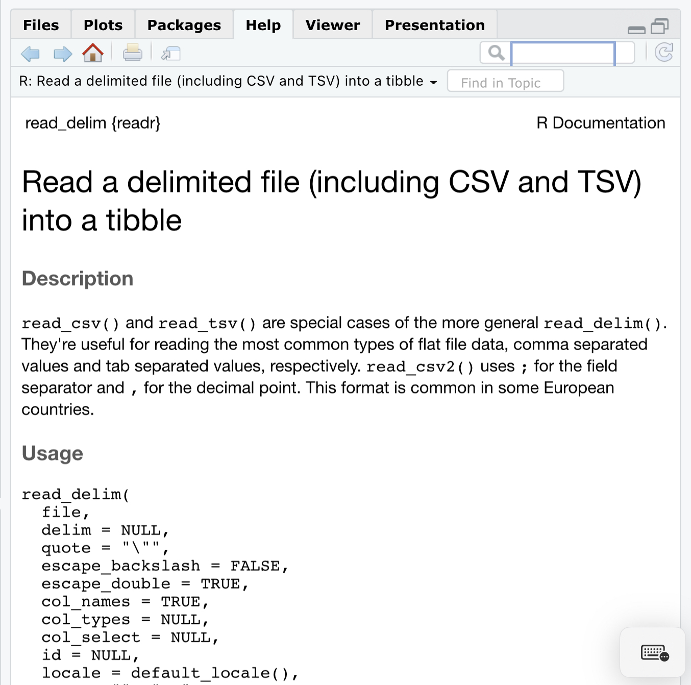
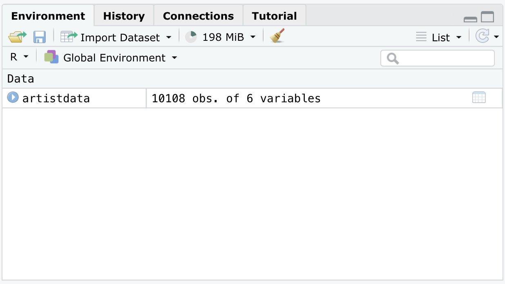
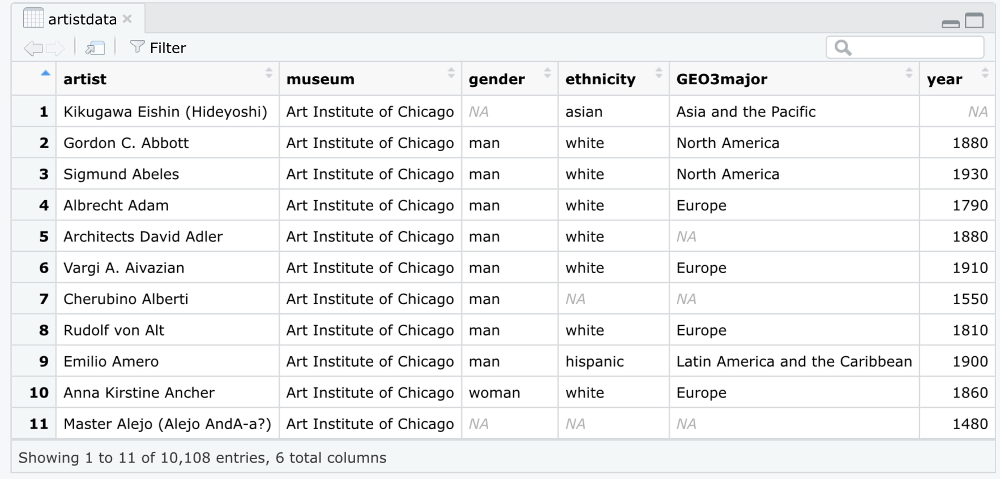

```{r setup, include=FALSE}
knitr::opts_chunk$set(echo = TRUE)
knitr::opts_chunk$set(cache = TRUE)
```

---

This work is governed under the [Creative Commons Attribution-NonCommercial-ShareAlike 4.0 International license](https://creativecommons.org/licenses/by-nc-sa/4.0/).

Citation: Chad M. Topaz, Andrew Lopez, Jude Higdon, Tyrone Bass. Data4Justice, ed. Brittney Bailey. National Math Festival and Institute for the Quantitative Study of Inclusion, Diversity, and Equity (2022).

---

# Acknowledgments

This work was created as a collaboration between the [National Math Festival](https://www.nationalmathfestival.org) (a program of the [Mathematical Sciences Research Institute](http://www.msri.org)), and the [Institute for the Quantitative Study of Inclusion, Diversity, and Equity (QSIDE Institute)](http://www.qsideinstitute.org). Thank you to our many contributors, including all co-authors, and a special thank you to Dr. Brittney Bailey for her technical assistance and masterful editing. Additional support for this project was provided by the [M3C Challenge](https://m3challenge.siam.org).

# Introduction

Welcome to the case study portion of the Data4Justice curriculum developed by the [Institute for the Quantitative Study of Inclusion, Diversity, and Equity (QSIDE)](http://www.qsideinstitute.org). This case study is designed to help you learn data science skills in a social justice context. At QSIDE, we hope that our curriculum will be used by anyone and everyone who is interested in helping to right wrongs by using quantitative tools. This case study should be accessible to advanced high school students, to undergraduate students, and to more experienced academics in any field who would like to learn new skills and ideas. QSIDE also envisions our case study being used by individuals working in industry, government, and the nonprofit sphere, as well as any hobbyists and other members of the general public wanting to challenge themselves. In short, if you are interested to and positioned to learn more about the interface of social justice and data science, this case study is for you.

If you are a high school teacher, a college or university faculty member, or serve in any other instructional capacity, consider using this case study in ways that are appropriate for your audience. Less experienced audiences might require a step-by-step approach, proceeding through the case study in a linear manner at a pace that is not rushed. More experienced audiences could benefit from using the beginning parts of the case study, and then being challenged to do more open-ended exploration. The case study could also be used as the basis for a data hackathon event.

No prior experience with computer programming is required. However, the case study assumes that you have access to RStudio, a programming environment built on the statistical computing language R. If you want to use RStudio on your own computer, you should first [install R](https://cran.r-project.org), and then [install RStudio](https://www.rstudio.com/products/rstudio/download/#download). Alternatively, you can register for a free account with [RStudio Cloud](https://rstudio.cloud), an online version of RStudio that you can access through any standard web browser. 

R is a powerful language, made even more powerful by additional free software packages that enhance its functionality. Regardless of how you run RStudio, you will need access to the packages below, which are automatically activated in the code that produces this document. Make sure you download these packages using the `Packages` tab in RStudio and run the commands below before proceeding with this case study.
```{r, message = FALSE, warning = FALSE}
library(tidyverse)
library(scales)
library(DescTools)
library(knitr)
library(treemapify)
```

QSIDE is a 501(c)3 tax-exempt nonprofit organization. Initiatives like our Data4Justice curriculum require resources to produce, and we depend on a public that is willing to support social justice initiatives. Anyone is welcome to use this document for free, but we ask those who are able to [please make a donation to QSIDE](https://qsideinstitute.org/support-us/donate/) so that we can maintain our innovative research, action, and education efforts at the interface of data science and social justice. Additionally, we ask anyone using any or all of this document

Now let's get to learning!

# Understand the data and the research study

## Define the type of study

Our case study centers around issues of demographic diversity in art museums, and is based on research performed by one of this case study's authors. Before proceeding, take some time to read the original study, [Diversity of Artists in Major U.S. Museums](https://journals.plos.org/plosone/article?id=10.1371/journal.pone.0212852). There may be some things in the paper that you don't understand — perhaps just a few, or perhaps many. That's ok. The goal of reading the paper is not to understand every detail, but rather, to provide a first exposure to the material you'll be working on and to get you excited about it. For convenience, here is the abstract.

---

**Abstract**

The U.S. art museum sector is grappling with diversity. While previous work has investigated the demographic diversity of museum staffs and visitors, the diversity of artists in their collections has remained unreported. We conduct the first large-scale study of artist diversity in museums. By scraping the public online catalogs of 18 major U.S. museums, deploying a sample of 10,000 artist records comprising over 9,000 unique artists to crowdsourcing, and analyzing 45,000 responses, we infer artist genders, ethnicities, geographic origins, and birth decades. Our results are threefold. First, we provide estimates of gender and ethnic diversity at each museum, and overall, we find that 85% of artists are white and 87% are men. Second, we identify museums that are outliers, having significantly higher or lower representation of certain demographic groups than the rest of the pool. Third, we find that the relationship between museum collection mission and artist diversity is weak, suggesting that a museum wishing to increase diversity might do so without changing its emphases on specific time periods and regions. Our methodology can be used to broadly and efficiently assess diversity in other fields

---

Research that uses data can often be classified as either observational or experimental. An observational study is one in which researchers collect data without influencing any of the factors under investigation. For instance, a study performed by asking classmates in the hallway what their favorite tv show is would be an observational study. In contrast, in an experimental study, researchers assign people or things to different groups and treat them differently in order to try to detect the effects of those different treatments. Many pharmaceutical studies are experimental in nature. Some individuals in the study get a particular drug and some get a placebo so that the researchers can attempt to see the effect of the drug.

This art study study is an observational study because the researchers attempt to learn about populations by studying a sampling of them in a context where the artists in a particular museum have already been determined by the museum itself. This is not an experimental study because the variables are not under our control. That is to say, we, as researchers, cannot manipulate the artists whose works are chosen to be displayed in museums.

## Understand how the museums in the study were chosen

The 18 museums in the original study were chosen by art experts on the research team to satisfy several criteria:

1. The museums are geographically dispersed.
2. The museums have a variety of funding models (public, private, college/university).
3. The museums are influential within the field of art.
4. The museums have their collections cataloged online, so that we may collect data.

While the museums were *not* chosen randomly, the idea of randomness plays a role. In the original study, 186,657 records were acquired from museum websites. Because of the monetary costs of coding the data for inferred demographics, the researchers were limited to studying a subset of the data. The data was chosen by randomly sampling the acquired museum data. Think of random sampling as akin to drawing scraps of paper out of a hat without looking, or to conducting a political poll by asking a small number of voters about their preferences. To guarantee a representative "poll" for every museum in the study, the researchers took a random sample from each. Overall, the random sample consists of 11,522 museum-artist pairings. However, after sampling, they eliminated artists who were not identifiable individuals, such as "Chinese, 4th century" and "Tiffany Glass."

## Define our variables and observations

## Download data using RStudio

In working with data, it is critical to be clear on what the variables are and what an observation is. *Variables* are characteristics we have information about. For instance, we will see that in the artists data set, variables include attributes like artist national origin and artist birth year. An *observation* is the collection of the values of variables for a unit of study. In the artists data set, an observation consists of all the information gathered about a specific artist within a specific museum. For example, Ana Mendieta is an artist who has at least one work in the San Francisco Museum of Modern Art, who was born in the decade beginning in 1900, and so forth. We will frequently use the word *record* interchangeably with *observation*. A widely-used standard for storing variables and records is that they appear in the form of a table (like a spreadsheet) where there is one column for each variable and one row for each record. For this reason, we will use *column* synonymously with variable, and *row* synonymously with observation and record.

## Key concepts, commands, and techniques

* observational study to learn about situations we can't manipulate
* random sampling for when we can't study all the data that theoretically exists
* variable/column, which is a characteristic we have information about in our data, and
* observation/record/row, which is a complete set of variable values for one unit of study

# Get data ready to analyze in RStudio

The data for this study is available online at [https://github.com/artofstat/ArtistDiversity/raw/master/artistdata.csv](https://github.com/artofstat/ArtistDiversity/raw/master/artistdata.csv). This data is stored in a .csv file. A .csv file is a comma-separated-values file, where line breaks separate the records and, within a record, a comma separates the values of the variables. Often, on the first line of the .csv file there will be special information called *headers*. Headers are simply the names of the variables.

We'll be using RStudio to analyze our data. RStudio is a statistical computing environment built around the statistical computing language R. Throughout this lesson, we'll be pretty casual about using the terms RStudio and R interchangeably even though RStudio is, technically, an interface to the R language.

We can load up a .csv data file in RStudio using the command `read_csv()`. This command can find .csv files several ways. The two most important ways are:

1. Using a *path* to a file that is stored directly on the computer where you are running RStudio, and
2. Using a *URL* (uniform resource locator) which for our purposes is just a web address.

Since our data is stored on the internet, we will focus on the second option above. The `read_csv()` command assumes that your .csv file has headers on the first line. If you ever work with a file that doesn't have headers, you can use the option `header = FALSE`. To learn more about any R topic, including specific commands like `read_csv()`, you can use the search box in the `Help` tab on the right hand side RStudio.

{width=50%}

Alternatively you can type the name of a command with a `?` before it in the RStudio console to get taken directly to the help page for that command. For instance, typing `?read_csv` produces the following result. In the image below, you're only seeing the very top of the extensive help page for the command.

{width=50%}

Let's now go ahead and load the data. When we do, we will use an *assignment* command  which looks like a left arrow. It's made up of the less than sign ("<", which you can type by pressing shift + comma on most U.S. keyboards) followed by a hyphen (to the right of the zero on most U.S. keyboards). The full command looks like this: `<-`. We'll use this command to assign the data we load into a named variable. If we just loaded the data without putting it into a variable, it would be free-floating without any way to access it. Instead, we load the data and we tell RStudio to store it in a variable whose name we can choose, so that we can access and manipulate the data later on. We'll use the variable name `artistdata`. By the way, notice that that the URL (web address) goes in quotation marks.


```{r}
artistdata <- read_csv("https://github.com/artofstat/ArtistDiversity/raw/master/artistdata.csv")
```

This creates our data set, called a *data frame* in R, for us to begin exploring. We'll refer to this data frame extensively throughout the rest of this lesson. Remember: the data frame is the entire data set we're working with, which we've now called `artistdata`. We can now move on to exploring this data.

## Describe the structure of the data

Now that the data is loaded, we want to understand its structure, in particular, the size of the data and the types of information it describes. By *size*, we mean the number of records (rows) and the number of variables (columns). *Type* refers to the kind of data each variable stores, for example, text data integers, real numbers, true/false data and so forth. Let's discuss how to find information about the structure of the data set.

You'll see the variable we created appear in the *Environment* tab on the right hand side of the RStudio interface.

{width=50%}

We can see that our data set consists of 10,108 observations of 6 variables. If you want to see the data in spreadsheet form, simply click on it in the environment tab.

{width=50%}

Equivalently, we could just type `View(artistdata)` in the console to open up the spreadsheet. Either way, it's important to understand that the spreadsheet isn't editable. It simply shows us what's stored in the data.

There is another way to get a sense of what's in the data, which is to use the `head()` command. Typing `head(artistdata)` will print out the first six rows of data in the console (as opposed to opening the spreadsheet viewing tab). To get a different number of rows, just type the desired number after the name of the variable. For instance, to see eight rows, we can do:

```{r}
head(artistdata,8)
```

Note that within RStudio, you won't see the double pound `##` sign. This sign is just a signal to you that in this document, what you're seeing is the output of a command you've just entered.

Finally, we can learn about the structure of the data using the `str()` command:

```{r}
str(artistdata)
```

We find out that our data set is stored as a `data.frame`, which is the fundamental way of storing records and variables in R. We see the size of the data set reiterated, namely, 10,108 records. Recall from the original research study that although 11,522 records were acquired from websites, the researchers eliminated ones that did not correspond to identifiable individuals, which explains this gap. Next, we see a list of the six variables, namely `artist`, `museum`, `gender`, `ethnicity`, `GE3major`, and `year.` We also find out what type of data we have. Here, `chr` stands for character which means textual data, and `int` stands for integer, that is, negative counting numbers, zero, and positive counting numbers: ...-3, -2, -1, 0, 1, 2, 3...

There are many different types of data in R in addition to the two you see here. A critical one is `factor`, which refers to categorical data, meaning data that can only take on a finite, discrete set of values. For instance, if we were describing the eye color of humans, the possible categories would be amber, blue, brown, grey, green, and hazel. Another data type you will likely encounter is `num`, which stands for *numeric* and means real numbers, that is, numbers more general than just integers such as $\pi$ and -9.8 and $\sqrt{2}$. You might also see data of type `logi` which stands for *logical* meaning `TRUE` and `FALSE`.

If we had just been interested in knowing the names of the variables in our data frame, without knowing information about their type, we could have used the `names()` command:

```{r}
names(artistdata)
```

The point of our explorations above is to give us a sense of how much data we are working with and what sorts of variables it has. Knowing this information will help us decide on appropriate explorations later on.

## Describe the content of data

When working with data, it is critical to be humble in your understanding of the *meanings* of variables. In the case of the artist data, by inspection, we can guess that `artist` refers to the name of the artist and `museum` to the name of a museum in which the artist has a work. We also see variables called `gender` and `ethnicity,` and we might be tempted to assume that these are, indeed, the artist's gender and race/ethnicity. However, as good social justice data scientists, we know that characteristics like an individual's gender and race/ethnicity can only be accurately stated by the individual. Having read the original study, we know the important context of these variables, namely, that they are variables *inferred* by workers on a crowdsourcing platform.

Next, we see a variable called `GEO3major` which appears to have something to do with geography, but from merely looking at the data set, it might be geography of the museum, geography related to the artist, or something else entirely. From reading the original study, we know that it is a crowdsourced inference of the region of the world in which each artist has national origin. Finally, there is a variable called `year` which could be year the work of art was produced, year it came into a museum, a year associated with the artist, or something else. We also notice that the values of `year` are all multiples of ten. From reading the original study, we know that `year` is related to the birth year of the artist, and that birth years were translated into birth decades, which explains the multiples of 10.

To recap, the variables that we have available to us are:

* `artist` (artist’s name),
* `museum` (name of the museum with a piece by the artist in the permanent collection),
* `gender` (inferred gender of the artist),
* `ethnicity` (inferred race/ethnicity of the artist),
* `GEO3major` (inferred regional origin of the artist), and
* `year` (birth year of the artist, translated into decades).


## Prepare data for analysis

Now that we have some context for the data, let's make sure it's in a form that will make analysis convenient. In the case of our artist data, we need to return to thinking about the types of variables. Let's review some of the more common data types we might use in R:

* Character data (data type `chr`) are data that are text-based and that, generally, have no meaningful categorization. These might be the unique names of people or objects, assuming that the names themselves don’t provide any other information.
* Categorical or factor data (data type `factor`) are data that might be grouped meaningfully, such as inferred racial/ethnic groups or geographic regions.
* Integers (data type `int`) are positive and negative counting numbers and zero.
* Numbers (data type `num`) are all real numbers.

When we use the `read_csv()` command, R will by default make any variables it construes as textual data to be `chr`, and any variables it construes as numerical data to be `int` or `num`.

> **Challenge Quiz**
>
> For each of the variables below, decide whether you think it should be `chr`, `factor`, `int`, or `num` type. It's ok if you aren't entirely sure. Make your best assessment and we will then discuss the choices together.
>
> * `artist`
* `museum`
* `gender`
* `ethnicity`
* `GEO3major`
* `year`

It makes sense to keep `artist`, which is an artist's name, as character data. Theoretically, we could make artist names a `factor`, also known as a *categorical variable*, but this would lead to thousands of categories which feels cumbersome and not useful. One rough guideline to consider is if we'd want to use a variable to group data together for exploration. If we do, it should probably be a `factor`, and if we don't, perhaps it should be `chr` data.

As with `artist`, `museum` is currently stored as character data. But in contrast to our situation with `artist`, there are only 18 different museums. Each museum appears many times in the data set, and we will want to cluster many artists into the category of which museum hold their works. Therefore, we will convert the `museum` variable into categorical data, that is, a `factor`. We do this with the following code:

```{r}
artistdata <- artistdata %>%
  mutate(museum = as.factor(museum))
```

In this line of code, we are replacing the data frame, `artistdata`, with an updated version of itself, in which we set the new version of the `museum` variable to be a factor version of the original variable, using the command `as.factor()`. The so-called *pipe* operator, `%>%` means take the data frame called artist data and do to it whatever commands follow the pipe. Both the pipe operator and the mutate command are part of the **tidyverse** library in R, an extremely important library for data scientists. For now, it's enough simply to understand that **tidyverse** exists and that you load libraries at the beginning of your R code using the `library()` command. As you continue in future work as a data scientist, you'll learn more about different libraries in R and their various capabilities. Above, we've split our piped commands across multiple lines. The line breaks are simply for readability. We'll tend to use these line breaks, but the commands work just as well without them.

> **Many Ways to Accomplish the Same Task**
>
> In R, there are often many different ways to accomplish a given task. Instead of using the command above, we could have written
>
> `artistdata <- artistdata %>% mutate(across(museum, as.factor))`
>
> This command means replaces `artistdata` with an updated version of itself where we have done the following: take the variable called `museum`, apply the command `as.factor()` to it, and replace the original version of the variable with the factor version. This way of converting to a factor, where we have used `across()`, will be especially useful when we want to do something to more than one column at a time.

Let's check to make sure our command worked. Try the following:

```{r}
str(artistdata)
```

We see that `museum` is now a `factor` variable with 18 different *levels*, which are the different categories. We also see some numbers listed. This is because despite the fact that we think about our `factor` variable having named levels, R secretly gives a number to each level. To see all the named levels of `museum`, we use the `levels()` command:

```{r}
levels(artistdata$museum)
```

Here, the dollar sign operator `$` pulls out the name of a column, namely `museum`, in our `artistdata` data frame. Notice that only one museum name includes geographic information. "Metropolitan Museum of Art, New York, NY" has this additional information that won't play a role in our explorations, and that makes the name of the museum more cumbersome. We can rename this level of the factor by typing:

```{r}
artistdata <- artistdata %>%
  mutate(museum = fct_recode(museum, 
                             "Metropolitan Museum of Art" = 
                               "Metropolitan Museum of Art, New York, NY"))
```

The use of `mutate()` is similar to before, but what's new is the `fct_recode()` command, which lets us replace one or more levels of a categorical variable with renamed version(s).

The variables `gender`, `ethnicity`, and `GEO3major` should also be categorical. We can convert them all at once. To do so, we'll want to tell the `mutate()` command all of the variables we are interested in, and we will do this using the command `c()`, which stands for concatenate, meaning, loosely, put stuff together. For instance, I could concatenate the numbers 1, 2, and 3 into one unit containing three sub-parts by writing

```{r}
c(1,2,3)
```

Let's go ahead and convert our variables, and take one last look at the structure of the data.

```{r}
artistdata <- artistdata %>%
  mutate(across(c(gender,ethnicity,GEO3major),as.factor))
str(artistdata)
```

## Key concepts, commands, and techniques

* `Help` tab and `?` to learn about topics and commands
* `read_csv()` to load data
* assignment operator `<-` to save something into a named variable
* `Environment` tab to see data set information
* `head()` to print very top of the data set in the console
* `str()` to learn about the structure of the data
* `data types` including `chr`, `int`, `num`, and `factor` describe the type of data as words, numbers, or categories
* Character data (data type `chr`), data that are text-based and that, generally, have no meaningful categorization
* Categorical or factor data (data type `factor`), data that might be grouped meaningfully
* Integers (data type `int`), positive and negative counting numbers and zero
* Numbers (data type `num`), all real numbers
* `levels`, the possible values that a factor variable can take on
* `names()` to see the names of variables in the data frame
* pipe operator `%>%` to conveniently operate on data frames
* `mutate()` to modify variables in a data frame
* `across()` to help modify multiple variables at once
* `levels()` to see the possible values of a `factor`
* `fct_recode()` to rename levels of a factor
* `data frame`, the entire data set we're working with

# Explore, summarize, and visualize a single variable

## Create tabular displays of categorical data and summaries of numerical data

As part of our data exploration, we need to check for missing data so we can plan for how to handle that missing data in our analysis. We know from reading the original study that it was not possible to make demographic inferences for some artists. This means that some records are incomplete. In R, the letters `NA` (not available) signify missing data. In other data sets you might encounter, missing data might appear different ways, such as just a blank string of text or a special numerical code such as 999. The clearest practice, however, is to code missing data as `NA` and fortunately, this is what has been done in our data set.

To check for missing data, we will use the command `complete.cases()`, which checks if each row of a data frame is complete. The command returns `TRUE` if it is complete, and `false` if there are values of `NA` anywhere in the row. Applying `complete.cases()` to the data frame will return a long list (technically a `vector`) of `logi` values, that is, `TRUE`s and `FALSE`s. To see the number of `TRUEs`, we can use the `sum()` command. The `sum()` command adds up certain types of data in `R` such as `num`, `int`, and `logi`. For instance, try:

```{r}
sum(c(1,2,3))
```

When we add up `logi` data, R gives `TRUE` a value of 1 and `FALSE` a value of 0. For example:

```{r}
sum(c(TRUE,FALSE,TRUE))
```

Now we can check how many records in our data.frame do not have any `NA`s in them. Type the following:

```{r}
artistdata %>%
  complete.cases() %>%
  sum()
```

This means that 10,108 - 6,087 = 4,021 records do have missing data for at least one variable. Those 4,021 records comprise 100 x 4,021/10,108 = 39.8% of the data. As we proceed with our analysis, we will make sure to account for missing data. It may seem like a lot of missing data, but recall that our tally of what's missing goes across all of our variables. The missing data for any single variable might be smaller.

Let's now try to explore each variable in more depth, beginning with `artist`. One thing we might want to know is how many unique artist names there are. In other words, the same artist might have works in several museums within our data set. We can try finding this out using a combination of two commands. First, `select()` lets us choose one or more variables of a data frame to focus on. Second, `n_distinct()` counts the number of unique values in a data frame. Let's do the following command:

```{r}
artistdata %>%
  select(artist) %>%
  n_distinct()
```

Aha! So indeed, there are duplicate artists. Unfortunately, in the data set we are studying, analysis of artist names is not possible because the names are not *normalized*. By normalization, we mean editing the various different versions of a given artist's name so that they are all consistent.

For instance, there are two records for the artist `Edgar Degas` and one for `Edgar Hillaire Degas`. These records all refer to the same person. You might think that we should simply ignore the middle name `Hillaire` and then we could easily identify that the artist is the same for these records. But this raises a number of challenges. What if there are other artists who have the same first and last name but differentiate themselves by using their middle names? If we eliminate the middle names, we will incorrectly group together records that in fact correspond to different artists.

There are many other examples of records that pose normalization challenges. For instance, here are a few pairs of artist names in the data:

* `Richard Ford` and `Ford Richard`
* `Ker-Xavier Roussel` and `Ker Xavier Roussel`
* `Martin Munka!csi` and `Martin Munkacsi`

For the first pair, one museum wrote artist names in the format First Last, while another wrote names as Last, First. For the second pair, one museum used a hyphen and one did not. For both pairs, the letter "a" in the last name should have an accent mark on it, that is, "á." When data was acquired and processed for one museum, the accented character was somehow translated as "a!" This could be because of character encoding issues, that is, issues having to do with how different computer systems and software packages handle character-type data. Alternatively, it could be due to choices the researchers made when processing the information they acquired from museum websites. For the second version of the name, the accented character is also missing but appears as a regular, unaccented "a."

In any case, the examples above are just a few instances of the hundreds, if not thousands, of such challenges with artist names in the data set. Normalizing textual data is often extremely challenging. For our present investigation, we decide not to analyze the `artist` variable. This precludes us making statements about individual artists, but it allows us to move on to analyze other information.

After `artist`, next in the data frame is the categorical variable `museum`. Let's find out how many records there are for each museum by using the `count()` command which will tabulate the number of instances of each level of the factored variable. To put the summary table, with the most frequent museum in the data appearing first, we will include the option `sort = TRUE` in the `count()` command. Finally, we can also use the `mutate()` command with the option `prop = proportions(n)` to also list the proportions in the summary table. Let's store our table in a variable called `museumtable`. Type this code:

```{r}
museumtable <- artistdata %>%
  select(museum) %>%
  count(museum, sort = TRUE) %>%
  mutate(prop = proportions(n))
museumtable
```

The Denver Art Museum has the most records in our data set, at 733, and the National Gallery of Art has the fewest, at 374. There is no missing data for the `museum` variable because the original researchers recorded the museum when they acquired data from museum websites.

In a similar way, we can create tables for the other categorical variables, namely `gender`, `ethnicity`, and `GEO3major`.

```{r}
artistdata %>%
  count(gender, sort = TRUE) %>%
  mutate(prop = proportions(n))

artistdata %>%
  count(ethnicity, sort = TRUE) %>%
  mutate(prop = proportions(n))

artistdata %>%
  count(GEO3major, sort = TRUE) %>%
  mutate(prop = proportions(n))
```

Thus far, we have included values of `NA` in our table because we want to highlight that fact that there is, indeed, missing data. Now we have one of our first major decisions to make about analyzing these data: what to do with the NA values in each category. Let’s start by considering different implications for how to handle `NA` values in our gender column. First, let’s remember how these values were created in the first place: based on the artist’s names, five individual crowdworkers performed internet research on the artist and either inferred the artist's gender as man, woman, or nonbinary, or instead, indicated that they couldn't make an inference. The crowdworkers then rated their confidence in their inference: 1 being not very confident, 3 being very confident. Values of `NA`, then, represent a scenario in which one or more workers were not able to make a confident inference and/or in which there was not consistent agreement among workers about the inference. That is, if two workers inferred the artist to be a man, two others inferred the same artist to be a woman, and a fifth said nonbinary, then the dataset would indicate `NA` for that artist's inferred gender. Similar processes were used to infer the race/ethnicity, regional origin, and birth decade of the artists.

So how will we deal with these missing data? Moving forward, we could decide to continue highlighting that data because we simply don't know anything about what the data should be. An alternative is that we could assume there is no bias due to the `NA` responses. That is to say, we could assume that those artists for whom the crowdsourcing process did not produce a specific inference about gender would be represented at similar levels to those artists for whom the process did produce an inference (and similarly for race/ethnicity, regional origin, and birth decade).

To illustrate this point, let’s consider a simpler case of only 110 artists. Let’s say that crowdsourcing infers the gender of 100 of those artists but comes up with `NA` for 10 of them. Among the 100 for whom gender is inferred, 80 are reported as men, 10 as women, and 10 as nonbinary. We might then assume that, for the 10 `NA` artists, 8 are men, 1 is a woman, and 1 is nonbinary.

This choice assumes that the records for which crowdworkers did not make an inference reflect the same proportions as in the data where they *did* make an inference. With that assumption, we could feel comfortable simply excluding the `NA` values from our data.

The `gender` variable makes this decision to exclude `NA` values more complicated. Although a missing value may reflect uncertainty about an artist's gender, it may also mean that the artist does not identify within the gender binary of either man or woman. In other words, the artist may identify their gender as nonbinary. Erasing this category also erases nonbinary artists from this data set. As good social justice data scientists, how might we change the way we collect data to be more inclusive of diverse identities? We must always be striving to better represent all genders (not merely man and woman), all racial/ethnic identities (including multiracial/multiethnic ones), not to mention other axes of identity.

In our decision to exclude the `NA` values form our data, it is absolutely critical to remember that we have made a big assumption. Part of good statistical ethics is really highlighting assumptions and making them clear.

As a data scientist, you'll often have to make decisions like this about how to want to deal with imperfect data. For our current exploration, we'll make the decision to exclude the `NA` data to ease our work moving forward.

Let's now re-do our previous work, but now using the command`drop_na()` so that we exclude `NA` values.

```{r}
artistdata %>%
  drop_na(gender) %>%
  count(gender, sort = TRUE) %>%
  mutate(prop = proportions(n))

artistdata %>% 
  drop_na(ethnicity) %>%
  count(ethnicity, sort = TRUE) %>%
  mutate(prop = proportions(n))

artistdata %>%
  drop_na(GEO3major) %>%
  count(GEO3major, sort = TRUE) %>%
  mutate(prop = proportions(n))
```

We note the large proportions of artists inferred to be men, to be white, and to have regional origin in North America or Europe. Critically, our results thus far do not tell us anything about the intersections of these identities. We haven’t yet discovered, for example, the proportion of Black women, Latino men, or Asians from West Asia in our data set.

What does this information tell us about the representation of artists in permanent collections in these major U.S. museums? We see that 87% of the artists are inferred to be men and 13% to be women. One way to look at these data is to compare the percentages to one another: that is, that men's representations is, overall, more than six times higher than women's within our data set. We can also benchmark the result to the U.S. population (recognizing that while the museums are all located in the U.S., certainly not all of the artists are U.S. based). Men make up approximately 49% of  the U.S. population, and women approximately 51%, according to the U.S. Census Bureau. So, women are underrepresented by 38 percentage points, that is, 51% in the U.S. overall minus 13% in our data set. Men are overrepresented by that same 38%, that is 87% in our data set minus 49% in the U.S. overall.

While the data set lets us observe a gender disparity, we still have no indication as to *why* the disparity exist. Perhaps women and men are encouraged/discouraged differently to pursue careers as artists. Perhaps men are more able to make a living as professional artists due to biases in funding streams. Perhaps the art industry looks disparagingly at married women and mothers so women who choose those paths don’t persist in working as artists throughout their careers. Perhaps men have greater access to the systems of power that allow them to get their works seen and therefore collected by museum curators and collectors. Perhaps museum curators and collectors are only looking for art in places traditionally dominated by men. These possibilities, and countless others, lend themselves to options for further research and activist intervention. Nonetheless, we now have empirical evidence of a substantial gender gap in museum collections.

Similar questions can be raised in regards to race/ethnicity and regional origin. Although the data set lets us observe disparities in representation for these variables, we aren't able to determine the reasons why they exist. The history of colonialism and systemic oppression no doubt plays a role in racial/ethnic marginalization in the arts. Class may also contribute to this issue since pursing art as a profession is too financially risky for many working class people. Western influence appears to have a strong hold on the art world with North American and European artists dominating museums. As a result, people of color may struggle to breakthrough into this exclusive industry that has historically excluded them. This influence may also be why other world regions are not represented in this country's museums.}}           

The variables we’ve examined so far have been categorical ones. We have yet to explore the birth decades of artists stored in the variable `year`. In principle, we could make a table of this data, but it would be really annoying! Without looking at the table itself let’s see how many different decades are represented by using the `n_distinct()` command from before. Code and output are below.

```{r}
artistdata %>%
  select(year) %>% 
  n_distinct()
```

That is a very long table (82 rows), and is not convenient to look at. In general, for numerical data when many different values are represented, we don't want to use tables to provide summaries. Instead, we can ask R to provide more helpful summary information for a variable:

* *Minimum*: the smallest value,
* *Maximum*: the largest value,
* *Mean*: the average value, obtained by adding together all values and dividing by the number of values (excluding `NA`s from this process),
* *Median*: the middle value, obtained by listing all of the values in increasing order and taking the one that is 50% of the way through the list (exluding `NA`s from this process),
* *1st Quartile*: similar to median, but as opposed to using 50%, taking the value that is 25% of the way through the sorted list of values,
* *3rd Quartile*: similar to median, but as opposed to using 50%, taking the value that is 75% of the way through the sorted list of values,

Fortunately, there is a single R command that calculates all of these for us, namely, `summary()`. Let's apply it to the birth decade variable:

```{r}
artistdata %>%
  select(year) %>%
  summary
```

We see, among other results, that the earliest birth decade is -400, the latest is 1990, the median is 1900, and the mean is 1866. We can infer that negative values of `year` correspond to years BCE ("Before Common Era"), that is, years before the year zero. Also, it's important to realize that the minimum, maximum, median, and the 1st and 3rd quartiles each take on a value that is found in the data. Hence, in our case, they are all multiples of 10. In contrast, the mean is found by adding up the data and dividing by the number of values. There's no mathematical reason that this needs to turn out to be a value found in the data, and indeed, the mean for our data is 1866. We know this is not a value of our data because the `year` variable has values that are all multiples of 10.

## Create plots to summarize and visualize categorical and numerical data

There are often multiple plots that one could make to visualize a particular data set. Part of the challenge and the fun of data visualization is choosing a plot that is clear to interpret and that tells an appropriate story in an honest way. In the visualization we do, we will be using the **ggplot2** package which is included in the **tidyverse** set of packages we loaded earlier in this lesson. The **ggplot2** package is a powerful (and again, fun) way to make many different kinds of plots.

Let's start with your categorical variables beginning with `museum`. One option is to use a bar chart to show the number of records from each museum, or alternatively, the proportion of the total records coming from each museum. Let's try this.

```{r}
artistdata %>% ggplot(aes(x=museum)) +
  geom_bar()
```

The command above takes our data frame, hands it to the main plotting command, which is `ggplot()`, specifies that we want the different museums arranged along the x-axis, and finally, produces a bar plot using `geom_bar()`. The plot has a number of issues and doesn't look very polished. We can make a few quick improvements. First, the x-axis is unreadable because the names of the museums are so long that they run in to each other. Second, it might be nice to put the bars in order from tallest to shortest. Finally, we can try to make the axis labels slightly more informative. Try this:

```{r}
artistdata %>%
  ggplot(aes(x=museum)) +
  geom_bar() +
  theme(axis.text.x = element_text(angle=60, hjust=1, vjust=1)) + 
  scale_x_discrete(limits = names(sort(table(artistdata$museum),
                                       decreasing=TRUE))) + 
  xlab("Museum") + 
  ylab("Number of Artist Records in Study")
```

The command beginning with `theme()` rotates the museum names to give us more readability. The options `angle`, `hjust`, and `vjust` control the angle of rotation and the justification. The command `scale_x_discrete()` is a way of tweaking the appearance of the x-axis when that axis displays a categorical variable. The option `limits` lets us set the order of the different categories as displayed in the graph, and the `names(sort(table))` command puts the museums in decreasing order from largest number of records to smallest. Finally, `xlab()` and `ylab()` let us specify the test for custom axis labels. We shouldn't belabor the details of all of these commands. It is generally a workable solution to use examples (such as the one above) and the RStudio help tab to achieve the look you want for a plot.

One further change we can make is to display the bars not as counts within each museum, but rather, as percentages of the total number of records in the entire data set. It takes some unusual syntax to do this, and again, it's probably not the type of command we should memorize, but rather, the type of command we should look up or copy from an example when we need to use it. Try:

```{r}
artistdata %>%
  ggplot(aes(x=museum, y = stat(count/sum(count)))) +
  geom_bar() +
  theme(axis.text.x = element_text(angle=60, hjust=1, vjust=1)) + 
  scale_x_discrete(limits=names(sort(table(artistdata$museum),
                                     decreasing=TRUE))) +
  scale_y_continuous(labels=percent) +
  xlab("Museum") + 
  ylab("Share of Artist Records in Study")
```

You see above some more code inside the `ggplot()` command that says that the `y` variable should be the count for each museum divided by the sum of the counts of all museums (that is, the total). There is also a `scale_y_continuous()` command that says to treat the y-axis values as percentages.

Let's go ahead and make similar plots for the remaining categorical variables starting with `gender`. Type all of the code below.

```{r}
artistdata %>%
  drop_na(gender) %>%
  ggplot(aes(x=gender, y = stat(count/sum(count)))) +
  geom_bar() +
  scale_y_continuous(labels=percent) +
  xlab("Inferred Gender") + 
  ylab("Share of Artist Records in Study")

artistdata %>%
  drop_na(ethnicity) %>%
  ggplot(aes(x=ethnicity, y = stat(count/sum(count)))) +
  geom_bar() +
  scale_y_continuous(labels=percent) +
  xlab("Inferred Ethnicity") + 
  ylab("Share of Artist Records in Study")

artistdata %>%
  drop_na(GEO3major) %>%
  ggplot(aes(x=GEO3major, y = stat(count/sum(count)))) +
  geom_bar() +
  theme(axis.text.x = element_text(angle=60, hjust=1, vjust=1)) + 
  scale_y_continuous(labels=percent) +
  xlab("Regional Origin") + 
  ylab("Share of Artist Records in Study")
```

The `drop_na()` command that we use above removes records that have `NA` for the specified variable, in keeping with the assumption we made earlier, namely, that there's no bias in which artists have `NA` values for that variable.

Finally, we can visualize our sole numeric variable, `year`, in a histogram:

```{r}
artistdata %>%
  drop_na(year) %>%
  ggplot(aes(x=year, y = stat(count/sum(count)))) +
  geom_histogram() +
  scale_y_continuous(labels=percent) +
  xlab("Birth Decade") + 
  ylab("Share of Artist Records in Study")
```

Although they look similar, histograms are used for numeric data, and gaps between the bars are meaningful. This graph can be improved. Most of the data is appearing towards the right side of the histogram. There is some data towards the left but it is extremely sparse. Because `ggplot()` shows all the data by default, we lose some sense of the shape of the bulk of the data because it is all compressed towards the right. If we are willing to exclude some data for our visualization, we can gain some resolution of the bulk of the data. Let's see what happens if we exclude the 5% of the data having the earliest birth decade. The command `quantile()` will calculate the 5th percentile for us, and we can use the result with the command `xlim()` to set the limits (range) of the x-axis. We'll take that 5th percentile as the low end of the axis range, and we'll specify `NA` as the high end. That might seem odd, but when you give an axis limit as `NA`, it means "whatever value R would choose by default." By the way, though we are modifying the x-axis, there is a similar command, `ylim()`, that we could use if we ever wanted to adjust the y-axis. Try this:

```{r}
pctile5 <- artistdata %>%
  drop_na(year) %>%
  pull(year) %>%
  quantile(0.05)

artistdata %>%
  drop_na(year) %>%
  ggplot(aes(x=year, y = stat(count/sum(count)))) +
  geom_histogram() +
  xlim(pctile5,NA) +
  scale_y_continuous(labels=percent) +
  xlab("Birth Decade") + 
  ylab("Share of Artist Records in Study")
```

The appearance of histograms depends substantially on the width of the *bin* which in our case means the number of different years that get grouped together to make one histogram bar. In R, we can specify either the width of a bin or we can specify the number of bars we want (one follows from the other). In the plots we made above, R chose a default value of 30 bins. Let's see how the plot looks if we set a binwidth of 20 years using the `binwidth = 20` option inside of `geom_histogram()` command.

```{r}
artistdata %>%
  drop_na(year) %>%
  ggplot(aes(x=year, y = stat(count/sum(count)))) +
  geom_histogram(binwidth = 20) +
  xlim(pctile5,NA) +
  scale_y_continuous(labels=percent) +
  xlab("Birth Decade") + 
  ylab("Share of Artist Records in Study")
```

There's no single, correct choice of binwidth. The right choices of binwidth are those that tell honest and useful stories about the data.

## Key concepts, commands, and techniques

* `select()` to choose particular variables from a data frame
* `unique()` to eliminate duplicates in data
* `nrow()` to learn the number of records in a data frame
* `NA` to represents missing data
* `complete.cases()` to check if a record contains missing data for any variable
* `sum()` to add up numbers or logical values
* normalization, the often-challenging process of making the data for a variable consistent
* character encoding, the ways that different computer systems and software packages handle character-type data
* `sort()` to put numbers in order
* `decreasing = TRUE` to tell the sort command put the data in decreasing order, with the biggest number first
* minimum, the smallest value of a variable
* maximum, the largest value of a variable
* mean, the average value of a variable, obtained by adding together all values and dividing by the number of values (exluding `NA`s from this process)
* median, the middle value of a variable, obtained by listing all of the values in increasing order and taking the one that is 50% of the way through the list (exluding `NA`s from this process)
* 1st quartile: similar to median, but as opposed to using 50%, taking the value that is 25% of the way through the sorted list of values
* 3rd quartile: similar to median, but as opposed to using 50%, taking the value that is 75% of the way through the sorted list of values
* `ggplot()` to make a wide variety of data visualizations
* `geom_bar()` to specify a bar plot when using `ggplot()`
* `theme()` and `scale_z_discrete()`, `scale_z_continuous()`, where `z` is replaced with `x` or  `y` to change and style the appearance of the plot
* `xlab()` and `ylab()` to provide appropriate axis labels
* `drop_na()` to remove records/values of a variable that are `NA`
* `quantile()` to calculate a percentile of a numerical variable
* `xlim()` and `ylim()` to specify a plot's axis ranges
* `binwidth()` to control how data is grouped together to make histogram bars
* `count()` to count the number of occurrences
* `mutate()` to mutate a data frame by adding new or replacing existing columns
* `prop = proportions(n)` to print out the percentages of a variable
* `summary()` to calculate the minimum, maximum, mean, median, and 1st and 3rd quartile

# Infer from data for a single variable

## Use statistics to make inferences about population parameters based on a random sample from that population

Earlier, we discussed the idea of sampling. The choice of museums in this study is certainly not a random sample of all U.S. art museums, so we cannot hope to make statistically valid statements about diversity of artists across all such museums. However, we *did* take a random sample of artist records from the 18 museums in the study. In short, our *population* is the 186,657 artist records from the 18 museums. Our *sample* is the 10,108 artist records drawn randomly from those.

We will try to learn something about the population based on our random sample. To emphasize a point we mentioned earlier, the idea here is similar to a political poll. In a political poll, the pollsters do not ask every eligible voter in the country who they plan to vote for. Instead, they take a random sample by asking, perhaps, a few thousand voters. But of course, we aren't interested *just* in the people in the sample. We are interested in how the election might actually go when many more eligible voters are voting. The process of making/drawing a conclusion about the entire population of interest (eligible voters) based on information in the sample (preferences of polled voters) is called *inference*. Of course, based on sample, we can't know beyond a doubt the results of the election. In the end, pollsters might report that the proportion of people in favor of a candidate is 39.6% +/- 2.3%, that is, 39.6% with a 2.3% margin  of error. These numbers may seem confusing now, but this lesson will teach you what they mean and how we calculate them using R. 

In our artist diversity study, we are using the word *inference* in two different contexts. There's the statistical inference we are discussing right now, and there is also the inference of demographic characteristics such as gender and ethnicity that was made by crowdworkers during the original study. Moving forward, we will *do* statistical inference, but we might use the language of "estimating something about the population" to avoid confusion with the other meaning of inference that we use.

## Create confidence intervals for categorical and numerical data

Whenever we use a statistical sample to estimate something about the population it comes from we need to create *confidence intervals* which give us a reasonable margin of error similar to in our political poll example. We will use the process of creating confidence intervals to try to make this more clear.

Let's begin with `gender`. We can recall from earlier that, excluding missing data, crowdworkers inferred about 87% of the artists in our sample to men and 13% to be women. We can use the command `MultinomCI()` to reproduce these numbers along with confidence intervals. The *Multinom* part stands for *multinomial* and refers to there being various categories. If there were only two categories, it's common to use the word `binomial`, but the `MultinomCI()` command will certainly still work in a binomial situation. The *CI* part of the `multinomialCI()` command stands for confidence interval. The confidence interval expresses our uncertainty about an estimate we make from our sample. In our political poll analogy, the estimate was 39.6% +/- 2.3%. This tells us an interval: 37.3% (which is 39.6% - 2.3%) to 41.9% (which is 39.6% + 2.3%). However, what the confidence interval actually is in a statistical estimate depends on how much confidence we want to have! A common choice is to use a *95% confidence interval*. Loosely speaking, what this means is that if we repeated the political poll  many, many times, always with a newly-generate random sample, then 95% of the time we should capture the true percentage of people voting for the candidate.

Let's go ahead and calculate 95% confidence intervals for the `gender` variable. Type this code:

```{r}
artistdata %>% 
  drop_na(gender) %>%
  count(gender) %>%
  data.frame(MultinomCI(.$n, conf.level = 0.95))
```

We can see that the *estimates* for the proportions are 87.2% men and 12.8% women, but that the 95% confidence interval for men is 86.6% to 87.9% and the 95% confidence interval for women is 12.1% to 13.4%.

Let's go ahead and produce analogous results for `ethnicity` and `GEO3major`:

```{r}
artistdata %>% 
  drop_na(ethnicity) %>%
  count(ethnicity) %>%
  data.frame(MultinomCI(.$n, conf.level = 0.95))

artistdata %>% 
  drop_na(GEO3major) %>%
  count(GEO3major) %>%
  data.frame(MultinomCI(.$n, conf.level = 0.95))
```

For our ethnicity variable, we find that, with 95% confidence, Asian artists comprise between 7.7% and 9.1%, Black artists comprise between 0.7% and 2.1%, Hispanic/Latinx artists comprise between 2.1% and 3.5%, artists of other ethnicities comprise between 0.8% and 2.2%, and white artists comprise between 85.1% and 86.6%.

Similarly, for regional origin, we find that, with 95% confidence, Asia comprises 7.1% to 9.3%, Europe comprises 42.1% to 44.4%, Latin America / Caribbean comprises 1.0% to 3.3%, North America comprises 44.8% to 47.1%, and West Asia comprises 0% to 1.3%.

## Key concepts, commands and techniques

* population, the entire group that we want to learn something about
* sample, the subgroup of the population for which we have data
* inference, the process of estimating something about the population based on data from the sample
* 95% confidence interval, a range of plausible values for estimating something in the population
* multinomial, describes a categorical variable with two or more levels
* `MultinomCI()` to calculate multinomial confidence intervals

# Explore, summarize and visualize relationships between two variables

## Create tabular displays of two variables

To explore the relationships between variables, let's first create all of the possible pairs of variables that we could explore. The individual variables we studied are `museum`, `gender`, `ethnicity`, `GEO3major`, and `year`. There are 10 different pairs of variables, then:

* `museum` and `gender`
* `museum` and `ethnicity`
* `museum` and `GEO3major`
* `museum` and `year`
* `gender` and `ethnicity`
* `gender` and `GEO3major`
* `gender` and `year`
* `ethnicity` and `GEO3major`
* `ethnicity` and `year`
* `GEO3major` and `year`

On one hand, these are all just pairs of variables. On the other hand, they have different contexts and meanings. Now that we are thinking about the relationships between variables, we need to think about *response variables* and *explanatory* variables. In short, a response variable is a *dependent variable* and an explanatory variable is an *independent variable*. A *response variable* is a variable that depends on something else and is potentially the focus of research questions. For us, the inferred artist demographics, namely `gender`, `ethnicity`, `GEO3major` and `year` are all response variables. The thing they depend on is what museum we are focusing on, so `museum` is called an *explanatory* variable because we are approaching the data with the idea that different museums might have different profiles in terms of the inferred demographics of their artists. That is to say, knowing what museum we are thinking of might help explain a particular set of demographics. 

Pairs containing `museum` tell us inferred demographic information within each museum. These pairs involve the explanatory variable `museum` and one response variable. Among those four pairs, those containing `gender`, `ethnicity`, and `GEO3major` involve two categorical variables, while the `museum`-`year` pair involves looking at a categorical variable and a numerical variable. Then, the remaining six pairs each contain two response variables. Some of these pairs contain two categorical variables and some contain a categorical variable and a numerical variable, namely, `year`.

Here are our pairs again, except we've grouped them according to whether the variables are response or explanatory, and also whether they are categorical or numerical. These distinctions might impact how we summarize, visualize, and interpret the data.

* Categorical explanatory variable and categorical response variable
+ `museum` and `gender`
+ `museum` and `ethnicity`
+ `museum` and `GEO3major`
* Categorical explanatory variable and numerical response variable
+ `museum` and `year`
* Two categorical response variables
+ `gender` and `ethnicity`
+ `gender` and `GEO3major`
+ `ethnicity` and `GEO3major`
* Categorical response variable and numerical response variable
+ `gender` and `year`
+ `ethnicity` and `year`
+ `GEO3major` and `year`

Let's move forward and study each group of pairings.

### Explore and summarize a categorical explanatory variable and a categorical response variable

Similar to how we coded the tabular displays of single variables, we'll use the `drop_na()`, `count()`, and `mutate()` commands here. To display two variables, we'll use the `group_by()` command and insert the explanatory variable. Try this:

```{r}
artistdata %>%
  drop_na(gender) %>%
  # group by explanatory variable
  group_by(museum) %>%
  # count response
  count(gender) %>%
  mutate(prop = proportions(n))

artistdata %>%
  drop_na(ethnicity) %>%
  # group by explanatory variable
  group_by(museum) %>%
  # count response
  count(ethnicity) %>%
  mutate(prop = proportions(n))

artistdata %>%
  drop_na(GEO3major) %>%
  # group by explanatory variable
  group_by(museum) %>%
  # count response
  count(GEO3major) %>%
  mutate(prop = proportions(n))
```

These commands are quite similar to the ones we used in Lesson III. Here, we are working with two variables at once rather than just one. We place the explanatory variable in the `group_by()` command to tell R that we want numbers and percentages across each row of the table, that is, for within each museum. We are much more interested in knowing, for instance, that the Art Institute of Chicago data has 35.5% artists inferred to be from North America than we are in knowing the answer to "what percentage of North American artists in the data are from the Art Institute of Chicago?" (By the way, the answer is 3.2%, which you can see by switching the explanatory and response variables). In all of the tables we made above, we only had to use `drop_na()` for our response variable because our explanatory one does not have any `NA`s.

The tables we made above are a bit hard to read. We can make a few changes in order to increase readability. First, we'll convert the values to percentages by adding a line of code to the `mutate()` command. The table for `ethnicity` will further need to have a line of code added to the `count()` command in order to display values of 0% instead of `NA`.  Next, we'll create side-by-side columns using the `pivot_wider()` command. Here, we can input the content of each column. In the first column, we want the names of the `museum` data. In the second and third columns, we want the names from the `gender` data and their values in the form of percentages. Finally, we come to the `kable()` command, which takes a data frame and prints it out in a nice format. The code to make the tables is below.

```{r}
artistdata %>%
  drop_na(gender) %>%
  # group by explanatory variable
  group_by(museum) %>%
  # count response
  count(gender) %>%
  mutate(prop = proportions(n),
         # convert to percentage
         percent = percent(prop, accuracy = 0.1)) %>%
  # create side-by-side columns
  pivot_wider(museum, names_from = gender, values_from = percent) %>%
  kable()

artistdata %>%
  drop_na(ethnicity) %>%
  # group by explanatory variable
  group_by(museum) %>%
  # count response (need `.drop = FALSE` to get 0 counts instead of NA)
  count(ethnicity, .drop = FALSE) %>%
  mutate(prop = proportions(n),
         # convert to percentage
         percent = percent(prop, accuracy = 0.1)) %>%
  # create side-by-side columns
  pivot_wider(museum, names_from = ethnicity, values_from = percent) %>%
  kable()

artistdata %>%
  drop_na(GEO3major) %>%
  # group by explanatory variable
  group_by(museum) %>%
  # count response (need `.drop = FALSE` to get 0 counts instead of NA)
  count(GEO3major, .drop = FALSE) %>%
  mutate(prop = proportions(n),
         # convert to percentage
         percent = percent(prop, accuracy = 0.1)) %>%
  # create side-by-side columns
  pivot_wider(museum, names_from = GEO3major, values_from = percent) %>%
  kable()
```

As you can see, this is much more readable than the first outputs we produced in this lesson.

Let’s identify a few interesting results using two basic strategies. First, we'll benchmark internally within the data, and then, we'll benchmark to an outside source.

When we benchmark internally within the data, we simply look at the data themselves and show any obviously large or small findings that emerge. For example, we might find that women are never represented at the same rates as men in any of the museums we studied and that white people represent more than 90% of the collected artists in multiple museums in our study. This is an internal benchmark because it looks only at one, two, or more data points within our data set and reports and/or compares them to one another as a means of exploring results.

Benchmarking against an external data source is another powerful tool in this type of analysis. When we benchmark against external data sources, we can compare representation in these museums to another standard; for example, we might try to look at gender and race/ethnic representation in the U.S. population more generally or the representation in other artistic or professional fields such as orchestras, the art film industry, commercial fashion, or even the high tech or high finance industries. These types of comparisons can provide context to the data.

Imagine, for example, that our data show that one museum has inferred gender representation of 92.7% for men and just 7.3% for women among artists in its permanent collection. That number seems egregious, facially; but you might ask, "well, what is the overall U.S. population like? If women artists were represented in these museums at the same rates as they are represented in the overall population, what would that breakdown look like?" Putting aside the subjective question of whether or not we believe demographics in a creative field *should* mirror the U.S. population, if we want to compare to that population then we need a trusted, valid data source on U.S. demographics. We can use the American Community Survey administered by the U.S. Census Bureau for these data. We'll make comparisons between our data and the U.S. population more broadly through the remainder of this curriculum. Please see Appendix A for the data we are using for U.S. population benchmarking.

Similarly, when looking at our data about regional origin for each artist we might want to know the global percentage of the population in each of those regions as a comparison. For example, if we find that a given museum has only 2% of the artists originally from Africa in their permanent collections, one natural next question would be, "what percentage of the global population is from Africa?" Again, we can look to the U.S. Census Bureau for global population statistics; refer to Appendix B for the data we are using here. We will refer to these benchmarks for comparisons throughout the remainder of this curriculum.

We can now highlight some results.

* The museum with the greatest disparity in gender representation among artists in its permanent collection is the New York Metropolitan Museum of Art with 92.7% men and 7.3% women.
* The museum with the smallest disparity in gender representation among artists in its permanent collection is the Museum of Contemporary Art with 75.1% men and 24.9% women.
* The range of gender disparity ranges from 3:1 men:women artists in the best case and 9:1 men:women artists in the worst case. No museum comes anywhere close to census parity (approximately 1:1 ratio of men:women).
* The Whitney Museum of American Art has the greatest over-representation of white artists at 91.7%. At census parity we would expect to see approximately 61% of the artists to be white; this is a 30 percentage point gap.
* The Art Institute of Chicago, as an example, has less than 1% representation of Black, Hispanic/Latinx, and other ethnically/racially minority artists (excluding Asian artists). The U.S. population is 12.7% Black, 17.2% Latinx, and 3.8% other ethnicities including American Indian / Alaska Native and Native Hawaiian / Pacific Islander.
* The High Museum of Art has the highest percentage of Black artists in its permanent collections at 10.6% which still falls two points below Census parity. No museum has Black artists represented at equivalent or higher levels than they are represented in the U.S. population overall.
* The Museum of Contemporary Art has the highest percentage of Latinx/Hispanic artists in its permanent collections. At 6.4%, this falls more than 10 points below Census parity. No museum had Hispanic/Latinx artists represented at equivalent or higher levels than they are represented in the U.S. population overall.
* In every museum studied artists from Europe and North America dominated the permanent collections with well over half the collection coming from these two global regions and, in some cases, with more than 90% of the collections coming from these two regions. These two regions make up only 17.5% of the world’s population.

### Explore and summarize a categorical explanatory variable and a numerical response variable

There is only one pair to consider that includes an explanatory variable and a numerical response variable, namely, `museum` and `year`. We could, in theory, try to use the `summary()` command from earlier on the `year` data for each museum, but that command gives perhaps more output (such as quantiles) then we would want to see in a brief summary table. So, we can make our own summary table that includes whatever we want. Let's choose minimum value, median, mean, maximum value, and standard deviation. The first four of those are summary statistics we are familiar with from earlier. The last one, standard deviation, is a measure of the spread of the data. In any case, the key new command is `group_by()` which organizes the data into separate slices, one for each museum in our case, before we calculate our summary statistics. After we `group_by(museum)` we'll use `summarise()` to produce the summary statistics we choose. An option like `minimum = min(year)` means summarize by taking the minimum of the year variable and name that summary statistic `minimum`. The commands for the summary statistics we want are `min()`, `median()`, `mean()`, `max()`, and `sd()`. The code and output are below.

```{r}
artistdata %>%
  select(museum,year) %>%
  drop_na(year) %>%
  group_by(museum) %>%
  summarise(minimum = min(year), 
            median = median(year), 
            mean = mean(year), 
            maximum = max(year), 
            stdev = sd(year)) %>%
  kable(digits=0)
```

The birth years of artists with collected works in the museums we studied span from 400 B.C.E. in the Boston MFA to the 1990s for several museums. All but three museums have median birth years of their collected artists in the 1800s. The remaining three --- the Museum of Modern Art, the San Francisco Museum of Modern Art, and the Whitney Museum of American Art --- have the median birth years in the 1900s. Finally, the museums with the smallest birth year standard deviations are the Museum of Contemporary Art, the Museum of Modern Art, the San Francisco Museum of Modern Art, and the Whitney Museum of American Art. This result is not surprising given that these four museums are focused on a specific time period. We expect that the artists collected by these museums would all have been born in a relatively short time period (perhaps 30-50 years apart) so their birth years would have less spread than a museum that collects art through many different periods.


### Explore and summarize two categorical response variables

We have three pairs of variables to examine here:
`gende` and `ethnicity`; `gender` and `GEO3major`; and `ethnicity` and `GEO3major`. We get different information depending on whether we look at overall percentages (that is, percentages for each intersection of categories), row percentages (percentages for the first variable), or column percentages (percentages for the second variable). If we don't give the `proportions()` command a `margin` option we get overall percentages. Let's do that and produce a nice table with percentages to one decimal place.

Let's first look at the overall percentages for `gender` and `ethnicity`, so that the sum of all values in the table adds up to 100%:

```{r}
artistdata %>%
  drop_na(gender, ethnicity) %>%
  count(gender, ethnicity) %>%
  mutate(prop = proportions(n),
         percent = percent(prop, accuracy = 0.1)) %>%
  pivot_wider(gender, names_from = ethnicity, values_from = percent) 
```

You can see that adding up all numbers in the table yields 100%. From this table, we can see, for instance, that 75.8% of the artists overall have been inferred to be white men and that somewhere between 0.3% and 0.5% have been inferred to be women from underrepresented/excluded ethnic groups. Within every minority racial/ethnic category women are represented at levels less than men.

Let's repeat the command above but include the `group_by()` command to obtain row percentages. This means that we'll look at *just* the men as a single group and *just* the women as a single group, and we will see how they compare within their own inferred gender categories.

```{r}
artistdata %>%
  drop_na(gender, ethnicity) %>%
  group_by(gender) %>%
  count(ethnicity) %>%
  mutate(prop = proportions(n),
         percent = percent(prop, accuracy = 0.1)) %>%
  pivot_wider(gender, names_from = ethnicity, values_from = percent)
```

Here, the rows (`man` and `woman`) each sum to 100%. It's interesting to note similarities and differences between the two rows. The percentage of inferred men who are also inferred to be white is quite close to the corresponding value for women (around 87%). So while white female artists are represented at far lower rates than male artists, when considering *just* the population of female artists, white women constitute the same outsized proportion as white male artists do when those white men are compared to other male artists. The distribution of the remaining 13% within each gender group varies considerably. For instance, Asian men have double the share of all men artists that Asian women have of all women artists.

Finally, let's examine the column sums which considers each racial/ethnic group as its own population:

```{r}
artistdata %>%
  drop_na(gender, ethnicity) %>%
  group_by(ethnicity) %>%
  count(gender) %>%
  mutate(prop = proportions(n),
         percent = percent(prop, accuracy = 0.1)) %>%
  pivot_wider(gender, names_from = ethnicity, values_from = percent)
```

For particular inferred ethnicities the inferred gender balance can look quite different. For instance, for artists inferred to be Hispanic there is a rather extreme gender distribution with almost 91% inferred to be men. For black artists it's a slightly less severe disparity with about 73% inferred to be men.

In principle we could make all three tables (overall percentage, row percentage, and column percentage) for each pair of variables. In the interest of concision, we'll just produce the overall percentage tables and note that the others can be obtained by dividing each entry by its row total or column total. Code and output are as follows:

```{r}
artistdata %>%
  drop_na(gender, GEO3major) %>%
  count(gender, GEO3major) %>%
  mutate(prop = proportions(n), 
         percent = percent(prop, accuracy = 0.1)) %>%
  pivot_wider(gender, names_from = GEO3major, values_from = percent)

artistdata %>%
  drop_na(ethnicity, GEO3major) %>%
  count(ethnicity, GEO3major) %>%
  mutate(prop = proportions(n),
         percent = percent(prop, accuracy = 0.1)) %>%
  pivot_wider(ethnicity, names_from = GEO3major, values_from = percent)
```

The vast majority (77.8%) of artists in the permanent collections of these museums are from Europe and North America and have an inferred gender of man. We don’t have cross tabular data for gender in the regions for our global demographic data (see Appendix B), but if we assume that gender in Europe is roughly 50/50 as it is in the United States then we might assume that the global population of men from Europe and North America would be approximately 8.7% of the total population of the world. These results point to the overrepresentation of European and North American artists in U.S. fine arts museums.

### Explore and summarize a categorical response variable and a numerical response variable

Now we'll group our numerical data (`year`) with each of our three categorical variables (`gender`, `ethnicity`, and `GEO3major`). We can produce these tables using commands we already know, similar to when we had a categorical explanatory variable and a numerical response variable:

```{r}
artistdata %>%
  select(gender,year) %>%
  drop_na(gender,year) %>%
  group_by(gender) %>%
  summarise(minimum = min(year), 
            median = median(year), 
            mean = mean(year), 
            maximum = max(year), 
            stdev = sd(year)) %>%
  kable(digits=0)

artistdata %>%
  select(ethnicity,year) %>%
  drop_na(ethnicity,year) %>%
  group_by(ethnicity) %>%
  summarise(minimum = min(year),
            median = median(year), 
            mean = mean(year), 
            maximum = max(year), 
            stdev = sd(year)) %>%
  kable(digits=0)

artistdata %>%
  select(GEO3major,year) %>%
  drop_na(GEO3major,year) %>%
  group_by(GEO3major) %>%
  summarise(minimum = min(year), 
            median = median(year), 
            mean = mean(year), 
            maximum = max(year), 
            stdev = sd(year)) %>%
  kable(digits=0)
```

Let’s start by examining `year` and `gender`. In our data set, the earliest (minimum) birth decade for a man was 400 BCE, or more than two thousand years ago. The earliest birth decade for a female artist was 1520, or just over 500 years ago. Next, let’s examine the mean and median for the `gender` groups. The mean `year` for men is about 80 years before the mean for women: 1854 vs. 1930. Similarly, the median birth year for men is 1900, and for women is 1940. This signals that the representation of female artists in museums is much more recent. Male artists through the ages are collected by museums, but only female artists who have been alive and working as artists relatively recently have had their work collected. This is supported by the difference in standard deviation between men (130 years) and women (44 years); meaning that the birth years of the male artists are spread out across a far greater time frame than the women.

We now turn to the `year` and `ethnicity` pairing. While Asian artists and artists in our “other” category span back to the ninth century (1000s), the first Black artists in these collections were born in the 1800s, and the first Hispanic artists collected were born in the year 1500. White artists born as far back as 380 BCE are represented in these museums. The median age for artists of color skews later as well: 1920 for Asians, 1940 for Black artists, 1940 for Hispanic artists, and 1950 for artists in our “other” category. White artists, on the other hand, have a median birth year of 1900. The mean birth year and standard deviation show more spread across different ethnic groups. However, note that Black artists have the latest mean birth year, 1939, as well as the smallest standard deviation, 30. This means that those few Black artists who are being collected in art museums are artists who have been alive and creating art relatively recently, and their birth dates are clustered within a relatively small time frame. 

Finally, let’s look at the data for `year` and `GEO3major`. A look at the means perhaps suggests groupings of regions. Africa and West Asia have relatively recent mean birth years of 1947 and 1953 respectively. Latin America and the Caribbean and North America have mean birth years of 1916 and 1917 respectively. Asia and the Pacific and Europe both have mean birth years in the 1800s. The standard deviations are widely different, with Africa and West Asia both having small standard deviations (23 and 16 respectively) and Europe and Asia and the Pacific having relatively larger standard deviations (155 and 135 respectively). It seems that African and West Asian artists collected by the museums were born later and in a tighter time frame than artists from other regions.

## Create plots to visualize two variables

For visual plots, we will use the same groups of pairings of variables as when we created tabular summaries of our data. These also depend on whether the variables are response or explanatory and categorical or numerical.

### Visualize a categorical explanatory variable and a categorical response variable

Let's begin by visualizing the gender distribution within each museum. We can do this mostly using commands we already know.

```{r}
artistdata %>%
  drop_na(gender) %>%
  ggplot(aes(x = museum, fill = gender)) +
  geom_bar(position = "fill") +
  theme(axis.text.x = element_text(angle = 60, hjust = 1, vjust = 1)) +
  xlab("Museum") + 
  ylab("Inferred Gender")
```

This is called a stacked bar plot. What's new is the `fill = gender` option within the `ggplot()` command, along with the `position = "fill"` option within the `geom_bar()` command. The first new option, `fill = gender`, tells `ggplot()` that we want to shade in bars according to gender. To get more of a sense of what the second option does we can try omitting `position = "fill"`.

```{r}
artistdata %>%
  drop_na(gender) %>%
  ggplot(aes(x = museum, fill = gender)) +
  geom_bar() +
  theme(axis.text.x = element_text(angle = 60, hjust = 1, vjust = 1)) +
  xlab("Museum") + 
  ylab("Inferred Gender")
```

Now the bars are all different heights and show total counts rather than proportions. We would like to highlight proportions within each museum, so we will keep `position = "fill"`.

We can make some other improvements to the graph. We can show percentages rather than proportions by adding the command `scale_y_continuous(label = percent)`. Also, we might like the title of the legend to be capitalized. We can change the legend title text using `scale_fill_discrete()`. We have already seen commands beginning with `scale_x()` and `scale_y()` to modify the x and y axes. We use `scale_fill` to modify the legend because the legend corresponds to our `fill` variable, namely, `gender`. Since `gender` is a categorical variable (taking on discrete values), we use `scale_fill_discrete()` with the option `name = "Gender"` to change the name (title) of the legend. 

```{r}
artistdata %>%
  drop_na(gender) %>%
  ggplot(aes(x = museum, fill = gender)) +
  geom_bar(position = "fill") +
  theme(axis.text.x = element_text(angle = 60, hjust = 1, vjust = 1)) +
  xlab("Museum") + 
  ylab("Inferred Gender") +
  scale_y_continuous(label = percent) + 
  scale_fill_discrete(name = "Gender")
```

Let's make another enhancement to the plot. R has chosen the colors for our plot automatically. We can make a different choice depending on what we hope to communicate with the plot. There are many issues to consider when choosing colors. For example, you should choose colors that are friendly to color-blind individuals. To address this, we'll use colors that have contrast and should be relatively easy to tell apart. To highlight underrepresented groups, we might decide to use a bright color for inferred women and a bland color for inferred men. Since this has to do with our discrete scale for `fill`, we'd hope to add more options to the `scale_fill_discrete()` command above. However, R is particular with how we modify colors. So, we will need to use `scale_fill_manual()` where you can interpret `manual` to mean that we are doing more customization. We'll retain our `name = "Gender"` option from before but add `values = c("grey","red"))` to specify that inferred men should be colored grey and inferred women should be colored red. R will interpret the colors we specify to correspond to the order of the levels of `gender` which happens to be `man` followed by `woman`.

```{r}
artistdata %>%
  drop_na(gender) %>%
  ggplot(aes(x = museum, fill = gender)) +
  geom_bar(position = "fill") +
  theme(axis.text.x = element_text(angle = 60, hjust = 1, vjust = 1)) +
  xlab("Museum") +
  ylab("Inferred Gender") +
  scale_y_continuous(label = percent) +
  scale_fill_manual(name = "Gender", values = c("grey", "red"))
```

Finally, we'd like to highlight differences in gender distribution between museums from the highest proportion of female artists to the lowest. By default, R is putting the museums in the order of the levels of the factor. Recall that "levels" here refers to the specific names of the museums in our `museum` factor variable. We can refresh ourselves on that ordering using the `levels()` command. When we used this command earlier, we did it using the `$` operator to pull a column out of our data frame. Another way to do this is to use the command `pull()`.

```{r}
artistdata %>%
  pull(museum) %>%
  levels
```

The museums appear to be in alphabetical order. Let's create our own ordering of the museums from the highest proportion of female artists to the lowest.

```{r}
genderorder <- artistdata %>%
  drop_na(gender) %>%
  group_by(museum) %>%
  count(gender) %>%
  mutate(prop = proportions(n)) %>%
  filter(gender == "woman") %>%
  arrange(desc(prop)) %>%
  pull(museum)
```

Much of what is above is the same as the commands we used when we created tables for two categorical response variables like `gender` and `ethnicity`.One new thing in this code is the `filter()` command which tell R which rows we want to work with. Here, We use `woman` which is the proportion of inferred women for each museum. A second new command is `arrange()` which sorts a data frame according to a variable. The `desc()` command that we put in `arrange()` tells R that we want to sort the filtered data from highest to lowest proportion. Finally, `pull()` is a command we introduced recently, and it pulls off the sorted list of museum names which is the ordering we will want to use in our plot. We stored the output of our commands in `genderorder`, that is, the ordering of museums we want when plotting gender. We can see that ordering just by typing the name of our new variable:

```{r}
genderorder
```

Now that we have our ordering as we want it we can repeat all of our plotting commands but using `scale_x_discrete(limits = genderorder)`. This command says "modify our x-axis, which is categorical, by putting the items in the order specified in the variable we created called `genderorder`". Code and output are as follows:

```{r}
artistdata %>%
  drop_na(gender) %>%
  ggplot(aes(x = museum, fill = gender)) +
  geom_bar(position = "fill") +
  theme(axis.text.x = element_text(angle = 60, hjust = 1, vjust = 1)) +
  xlab("Museum") +
  ylab("Inferred Gender") +
  scale_y_continuous(label = percent) +
  scale_fill_manual(name = "Gender", values = c("grey", "red")) +
  scale_x_discrete(limits = genderorder)
```

We discussed these data when they were in tabular format. Now that you see them in visual format, what jumps out to you? Pose some questions regarding inferred gender here and try to interpret the data.

Let's recreate everything we have just done but focusing on `ethnicity` rather than `gender`.

```{r}
artistdata %>%
  drop_na(ethnicity) %>%
  ggplot(aes(x = museum, fill = ethnicity)) +
  geom_bar(position = "fill") +
  theme(axis.text.x = element_text(angle = 60, hjust = 1, vjust = 1)) +
  xlab("Museum") +
  ylab("Inferred Ethnicity") +
  scale_y_continuous(label = percent)
```

This plot is a bit difficult to read because we haven't yet modified the colors or the ordering of the bars. Asking a reader to discern five colors in a bar plot, especially when some of the shaded regions are very small, might be too difficult. Recognizing that artists' experiences will vary both within ethnic groups and across ethnic groups we might still consider aggregating ethnic groups that are minoritized simply to draw the reader's attention to the over-representation of artists inferred to be white. The original, more granular information about `ethnicity` will still be available in the summary table we made earlier.

To do the aggregation the only new command we will need is `fct_collapse()` which lets us collapse several levels of a factor into a new one. We collapse `asian`, `black`, `hispanic` and `other` into `minoritized` and store the collapsed version of the variable into a new variable called `ethnicitysimple`

```{r}
artistdata <- artistdata %>%
  mutate(ethnicitysimple = fct_collapse(ethnicity, 
                                        "minoritized" = c("asian",
                                                          "black",
                                                          "hispanic",
                                                          "other")))
```

Let's check the levels of the new factor.

```{r}
artistdata %>% pull(ethnicitysimple) %>% levels
```

If we keep the levels in this order, `minoritized` percentages will occupy the top part of our shaded-in bars in the plot. We think it makes more sense for these to be on the bottom so we'll re-order the factor with `white` first. We can do this using the `fct_relevel()` command.

```{r}
artistdata <- artistdata %>%
  mutate(ethnicitysimple =
           fct_relevel(ethnicitysimple,"white","minoritized"))
```

Now, we can go ahead and make the final version of our plot. Similar to what we did for `gender`, lets order the `ethnicity` data from the highest proportion of minority artists to the lowest.

```{r}
ethnicityorder <- artistdata %>%
  select(museum,ethnicitysimple) %>%
  table %>%
  proportions(margin = 1) %>%
  as.data.frame.matrix %>%
  rownames_to_column("museum") %>%
  arrange(desc(minoritized)) %>%
  pull(museum)

artistdata %>%
  drop_na(ethnicitysimple) %>%
  ggplot(aes(x = museum, fill = ethnicitysimple)) +
  geom_bar(position = "fill") +
  theme(axis.text.x = element_text(angle = 60, hjust = 1, vjust = 1)) +
  xlab("Museum") +
  ylab("Inferred Ethnicity") +
  scale_y_continuous(label = percent) +
  scale_fill_manual(name = "Ethnicity", values = c("grey", "red")) +
  scale_x_discrete(limits = ethnicityorder)
```

Let's now make the last plot of our categorical explanatory variables and categorical response variables: `museum` and `GEO3major`. This variable has six levels but, like our `ethnicity` variable, visualizing them all in a stacked bar is possible but perhaps not viewer-friendly. Similar to how we aggregated the minority ethnicities together to highlight their underrepresentation compared to the dominate group, we will do the same for `GEO3major`. Lets aggregate the dominant geographic regions into one group, North America and Europe (`nae`), and the underrepresented regions into a second group, Africa, Asia, and Latin America (`aala`).

```{r}
artistdata <- artistdata %>%
  mutate(GEO3simple = fct_collapse(GEO3major, 
                                   NAE = c("North America", "Europe"),
                                   AALA = c("Africa",
                                            "Asia and the Pacific",
                                            "Latin America and the Caribbean", "West Asia")))

artistdata <- artistdata %>%
  mutate(GEO3simple = fct_relevel(GEO3simple,"NAE","AALA"))

GEO3order <- artistdata %>%
  select(museum,GEO3simple) %>%
  table %>%
  proportions(margin = 1) %>%
  as.data.frame.matrix %>%
  rownames_to_column("museum") %>%
  arrange(desc(AALA)) %>%
  pull(museum)

artistdata %>%
  drop_na(GEO3simple) %>%
  ggplot(aes(x = museum, fill = GEO3simple)) +
  geom_bar(position = "fill") +
  theme(axis.text.x = element_text(angle = 60, hjust = 1, vjust = 1)) +
  xlab("Museum") +
  ylab("Inferred Regional Origin") +
  scale_y_continuous(label = percent) +
  scale_fill_manual(name = "Regional Origin", 
                    values = c("grey", "red")) +
  scale_x_discrete(limits = GEO3order)
```

We discussed these data when they were in tabular format. Now that you see them in visual format, what jumps out to you? Pose some questions regarding the representation of inferred race/ethnicity and regional origin here and try to interpret the data.

### Visualize a categorical explanatory variable and a numerical response variable

Now let's look at how `year` varies with `museum`. We'll need a type of plot we haven't yet used because we have one numerical variable and one categorical variable. A *boxplot* is a way of visualizing the distribution of a numerical variable (`year`), and we can make one for each category (`museum`). A boxplot has the following visual features:

* A box whose lower end is at the 25th percentile and whose upper end is at the 75% percentile
* A horizontal line to represent the median
* Lines that extend to the maximum and minimum values *excluding outliers* (data determined to be especially far from the rest of the distribution)
* Dots that represent outliers

Let's try a boxplot with museums in order of decreasing median of inferred birth year. The command to create this type of plot using `ggplot()` is `geom_boxplot()`.

```{r}
artistdata %>%
  drop_na(year) %>%
  ggplot(aes(x = fct_reorder(museum, year, median, .desc = TRUE), 
             y = year)) +
  geom_boxplot() +
  theme(axis.text.x = element_text(angle = 60, hjust = 1, vjust = 1)) +
  xlab("Museum") +
  ylab("Inferred Birth Year")
```

This plot looks ok, but its readability is hindered by the large range on the y-axis due to outliers. Outliers are data points that are an abnormal distance from other points in the dataset. If we are willing to forego plotting outliers and change the y-axis range to be smaller, we can get a more readable plot. To tell `geom_boxplot()` to plot data without visualizing the outliers the easiest option is to use `outlier.shape = NA`. Technically, the outliers will still be plotted, but they will be "plotted" without a shape (that is, without a dot) so we won't see them. Let's use this option, and let's set our y-axis to range from 1400 to 2000.w

```{r}
artistdata %>%
  drop_na(year) %>%
  ggplot(aes(x = fct_reorder(museum, year, median, .desc = TRUE), 
             y = year)) +
  geom_boxplot(outlier.shape = NA) +
  theme(axis.text.x = element_text(angle = 60, hjust = 1, vjust = 1)) +
  xlab("Museum") +
  ylab("Inferred Birth Year") +
  ylim(1400,2000)
```

The somewhat mysterious warning message occurs because there are 33 outlying values of `year` that are outside of the y-axis range we have chosen.

Again, we interpreted these data above when we had data tables. Examine this boxplot and see if you can ask and answer any other questions from these data.

### Visualize two categorical response variables

We’ll start to visualize our pairs of categorical response variables with `gender` and `ethnicity`. The first thing we'll want is the proportions table for these two variables, and we'll want it in the form of a data frame. Before, we accomplished this by doing:

```{r}
artistdata %>%
  drop_na(gender, ethnicity) %>%
  count(gender, ethnicity, .drop = FALSE) %>%
  mutate(prop = proportions(n),
         percent = percent(prop, accuracy = 0.1)) %>%
  pivot_wider(gender, names_from = ethnicity, values_from = percent)
```

This is a convenient form of the table for a person to read. However, when we use `ggplot()` R wants the data to be in a different form where there is one row for each combination of inferred gender and inferred ethnicity. In other words, we need to create a category of men and women for each ethnicity. Fortunately, we can get the data in this form by using same commands as above but without the `pivot_wider()` command.

```{r}
artistdata %>%
  drop_na(gender, ethnicity) %>%
  count(gender, ethnicity, .drop = FALSE) %>%
  mutate(prop = proportions(n))
```

The column called `prop` contains the proportions we'd like to visualize. There are likely lots of ways we could visualize the data. We will choose to make a plot called a *tree map* which visualizes parts of a data set as rectangles of different sizes depending on some aspect of the data. The command to produce a tree map is `geom_treemap()`. Let's take our previous code, which created the necessary data frame, and add to it in order to plot. We will tell `ggplot()` that the area of each rectangle in the tree map should correspond to the frequency of each `gender`-`ethnicity` pairing.

```{r}
artistdata %>%
  drop_na(gender, ethnicity) %>%
  count(gender, ethnicity, .drop = FALSE) %>%
  mutate(prop = proportions(n)) %>%
  ggplot(aes(area = prop)) +
  geom_treemap()
```

There is a lot we need to improve about this plot. Most importantly there is no text telling us what part of the data each rectangle corresponds to. Let's create some text labels for each row of the data frame by creating a new column that puts together `gender` and `ethnicity` separated by a plus sign. We'll call this new column `genderethnicity` and we can make it by using `mutate` along with the `paste0` command which combines two or more bits of character data.

```{r}
artistdata %>%
  drop_na(gender, ethnicity) %>%
  count(gender, ethnicity, .drop = FALSE) %>%
  mutate(prop = proportions(n), 
         genderethnicity = paste0(gender, " + ", ethnicity))
```

This new column looks good so let's go ahead and feed this into our tree map plotting commands. To specify the text in the tree map we use the `label = genderethnicity` option within the `ggplot` command and add on the `geom_treemap_text()` command. For this command, we'll use the options `color = red` to make the text pop, and we'll use `reflow = TRUE` to allow the text to wrap within the rectangles as necessary.

```{r}
artistdata %>%
  drop_na(gender, ethnicity) %>%
  count(gender, ethnicity, .drop = FALSE) %>%
  mutate(prop = proportions(n), 
         genderethnicity = paste0(gender, " + ", ethnicity)) %>%
  ggplot(aes(area = prop, label = genderethnicity)) +
  geom_treemap() +
  geom_treemap_text(color = "red", reflow = TRUE)
```

This is better! Let's fix our other two issues: the color of the rectangles and the thickness of our separating lines. To see a list of colors in R we can use the `colors()` command. This command outputs 657 possible colors. In the interest of brevity in demonstrating the command below we'll use the `head()` command just to list the first 30.

```{r}
head(colors(),30)
```

Being conscious of color-blind individuals, let's choose colors that have contrast and are easy to tell apart. To address this, we'll look for some grey colors. There are grey colors labeled `grey1` through `grey100`. Let's decide to look at the multiples of ten, but even typing those 10 multiples is a pain. We can use the `seq()` command to make a sequence of numbers with options `from =`, `to = `, and `by =` to set the starting value, the ending value, and the interval between values.

```{r}
seq(from = 10, to = 100, by = 10)
```

If we now `paste0` these with the word grey in front, we'll get the colors we're interested in.

```{r}
paste0("grey",seq(from = 10, to = 100, by = 10))
```

It's not enough for us to just write down the colors we are interested in. We want to actually see them! We can do this with the `show_col()` command.

```{r}
paste0("grey",seq(from = 10, to = 100, by = 10)) %>%
  show_col
```

Let's go with `grey80`.

Now we're ready to make our final plot. We can use the options `fill = ` to set rectangle color and `size = ` to set separator line thickness.

```{r}
artistdata %>%
  drop_na(gender, ethnicity) %>%
  count(gender, ethnicity, .drop = FALSE) %>%
  mutate(prop = proportions(n), 
         genderethnicity = paste0(gender, " + ", ethnicity)) %>%
  ggplot(aes(area = prop, label = genderethnicity)) +
  geom_treemap(fill = "grey80", size = 2) +
  geom_treemap_text(color = "red", reflow = TRUE)
```

What do you see in the data? See if you can ask and answer some questions using the data represented in this tree map.

Now that we have nailed down this plot, let's go ahead and make plots for the other combinations of categorical response variables.

```{r}
artistdata %>%
  drop_na(gender, GEO3major) %>%
  count(gender, GEO3major, .drop = FALSE) %>%
  mutate(prop = proportions(n),
         genderGEO3major = paste0(gender, " + ", GEO3major)) %>%
  ggplot(aes(area = prop, label = genderGEO3major)) +
  geom_treemap(fill = "grey80", size = 2) +
  geom_treemap_text(color = "red", reflow = TRUE)

artistdata %>%
  drop_na(ethnicity, GEO3major) %>%
  count(ethnicity, GEO3major, .drop = FALSE) %>%
  mutate(prop = proportions(n),
         ethnicityGEO3major = paste0(ethnicity, " + ", GEO3major)) %>%
  ggplot(aes(area = prop, label = ethnicityGEO3major)) +
  geom_treemap(fill = "grey80", size = 2) +
  geom_treemap_text(color = "red", reflow = TRUE)
```

One final note: Some of the rectangles in our final treemaps are small enough that `geom_treemap()` won't put text inside them. If we are unhappy with this, we could make treemaps with the same simplified `gender`, `ethnicity`, and `GEO3major` variables we made earlier. Doing so would produce a simpler visualization at the cost of losing granular information about the data.

### Visualize a categorical response variable and a numerical response variable

The plots we will make here will be quite similar to those we made for when we have a categorical explanatory variable as opposed to a categorical response variable. More specifically, we'll use a boxplot to visualize our categorical response variables and numerical response variables.

```{r}
artistdata %>%
  drop_na(gender,year) %>%
  ggplot(aes(x = gender, y = year)) +
  geom_boxplot(outlier.shape = NA) +
  xlab("Inferred Gender") +
  ylab("Inferred Birth Year") +
  ylim(1400,2000)

artistdata %>%
  drop_na(ethnicity,year) %>%
  ggplot(aes(x = ethnicity, y = year)) +
  geom_boxplot(outlier.shape = NA) +
  xlab("Inferred Ethnicity") +
  ylab("Inferred Birth Year") +
  ylim(1400,2000)

artistdata %>%
  drop_na(GEO3major,year) %>%
  ggplot(aes(x = GEO3major, y = year)) +
  geom_boxplot(outlier.shape = NA) +
  theme(axis.text.x = element_text(angle = 60, hjust = 1, vjust = 1)) +
  xlab("Inferred Regional Origin") +
  ylab("Inferred Birth Year") +
  ylim(1400,2000)
```

## Key concepts, commands and techniques

* response/dependent variable, depends on something else and is commonly the focus of research questions
* explanatory/independent variable, helps explain values of a response variable
* `group_by()` to group by either the response or explanatory variable
* `pivot_wider()` to create side-by-side columns
* `percent()` to convert proportions to percentages
* `accuracy = 0.1` to tell `percent()` to keep one decimal place after converting to percentages
* `kable()` to produce nicely formatted tables
* `min()` to find the smallest value of a set of numbers
* `median()` to find the median value of a set of numbers
* `mean()` to find the mean value of a set of numbers
* `max()` to find the largest value of a set of numbers
* standard deviation, a measure of how spread out the numbers in a data set are
* `sd()` to calculate the standard deviation of a set of numbers
* `fill = ` option within the `ggplot()` to shade plot according to values of a variable you specify
* `position = fill` option with `geom_bar()` in order to create a stacked, proportional bar plot
* `scale_y_continuous(label = percent)` to change proportions in our bar plot to percentages
* `scale_fill_discrete(name = )` to change the title of the legend which shows information about the variable we have used to fill in color in our plot
* `scale_fill_manual(name = , values = c())` to change both the title of the legend and the specific colors for the variables in our plot
* `rownames_to_column()` to add the row names of a data frame explicitly as a column in that data frame so that we can more easily work with them
* `filter()` to return rows with matching conditions
* `pull()` to pull out a single column of a data frame so that we can more easily work with it
* `arrange()` to sort a data frame by a variable
* `desc()` to tell `arrange()` that we want to sort in descending (decreasing) order
* boxplot, a way of visualizing the distribution of a numerical variable using boxes and lines
* `geom_boxplot()` to produce a boxplot
* `as.data.frame` to convert an object to a data frame
* treemap, visualizes parts of data set as rectangles of different sizes depending on some aspect of the data
* `geom_treemap()` to create a tree map
* `area =` to specify how the area of rectangles should be determined in a tree map
* `paste0` to combine two or more pieces of character data into one piece
* `label =` to tell `ggplot()` to use some textual data that we provide
* `geom_treemap_text()` to make the textual data appear as labels in a tree map
* `color =` to tell `geom_treemap_text()` what color to make text
* `reflow = TRUE` to tell `geom_treemap_text()` to wrap text within each rectangle of a tree map as necessary
* `colors()` to see a list of colors
* `show_col()` to visualize colors
* `fill = ` to tell `geom_treemap()` what color to make the rectangles
* `size = ` to tell `geom_treemap()` what thickness to make separator lines

# Appendix A: American Community Survey Data {-}

Data from U.S. Census Bureau, ACS 2019 5-year estimates

```{r echo = FALSE}
Ethnicity <- c("AIAN","ASIAN","Black","Latinx","NHPI","Not Listed","White")
AGNN <- rep("Not Measured", 7)
Man <- percent(c(0.004,0.026,0.061,0.087,0.001,0.014,0.300),0.1)
Woman <- percent(c(0.004,0.029,0.066,0.085,0.001,0.014,0.039))
df <- data.frame(Ethnicity = Ethnicity, AGNN = AGNN, Man = Man, Woman = Woman)
kable(df, align = "llrr")
```

# Appendix B: Global World Population {-}

Data from U.S. Census Bureau, as of 2020

```{r echo = FALSE}
Continent <- c("Africa", "Asia", "Europe", "North America", "Oceania", "South America")
Population <- c("1,261","4,531","731","595","39","440")
Percent <- percent(c(0.1660,0.5964,0.0962,0.0783,0.0051,0.0579), 0.01)
df <- data.frame(Continent = Continent, Population = Population, Percent = Percent)
kable(df, col.names = c("Continent", "Population (millions)", "Percent of Total"), align = "lrr")
```

| Continent     | Population (millions) | Percent of Total |
|:-------------:|:---------------------:|:----------------:|
| Africa        | 1,261                 | 16.60%           |
| Asia          | 4,531                 | 59.64%           |
| Europe        | 731                   | 9.62%            |
| North America | 595                   | 7.83%            |
| Oceania       | 39                    | 0.51%            |
| South America | 440                   | 5.79%            |